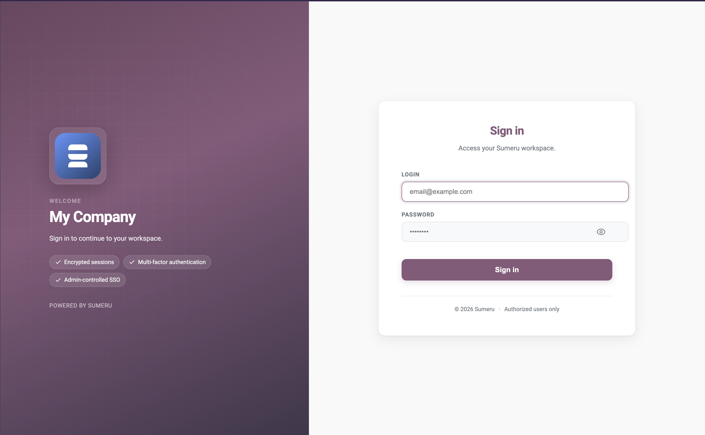
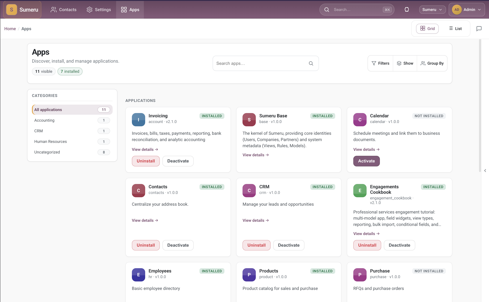
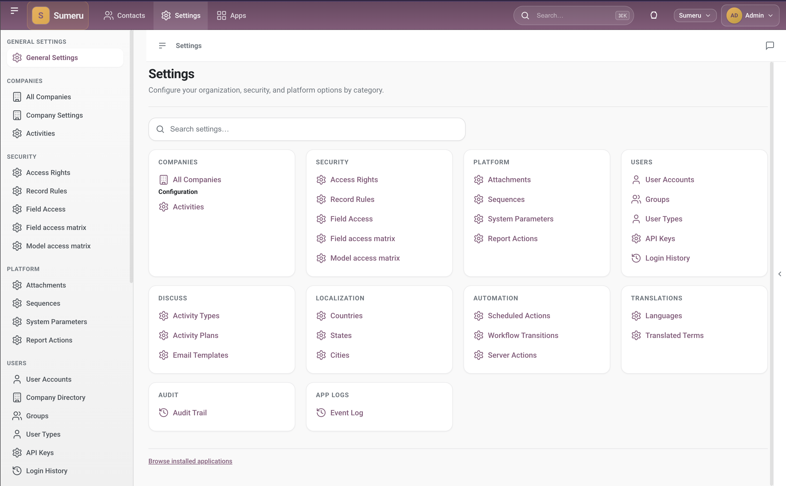

# Sumeru

**Modular open-source ERP/CRM framework** — Go backend, PostgreSQL, installable apps (addons), XML views, and a TypeScript workspace (SWC) client.

[](https://github.com/ProjectMeru/sumeru/actions/workflows/ci.yml)
[](LICENSE)

[Documentation](https://projectmeru.github.io/sumeru/docs/)

> **Pre-alpha** — not for production. APIs and schemas may change. Use for local development and evaluation only.

Sumeru is a modular platform for ERP and CRM workloads: persist data in **PostgreSQL**, define screens with XML **views**, install **apps** from disk (Go models + manifests), and run day-to-day work in a web **workspace** (list, form, kanban, and analysis views). Standard business apps live in **[sumeru_addons](https://github.com/ProjectMeru/sumeru_addons)**; this repo is the **core engine** (`module sumeru`).

## Preview

**Sign-in** — enterprise login shell with optional company logo and tagline on the left panel.



**Apps** — browse, install, and open CRM/ERP modules from the catalog.



**Settings & workspace** — configure the organization and work in list, form, and analysis views.



## Prerequisites

- [Go 1.26.6+](https://go.dev/dl/)
- [Node.js](https://nodejs.org/) (npm — builds SWC UI bundles; not committed to git)
- [PostgreSQL](https://www.postgresql.org/)
- Git  
- Optional: Docker for `make test-integration`

## Repositories

| Repo | Role |
|------|------|
| **[sumeru](https://github.com/ProjectMeru/sumeru)** | Core engine + kernel apps (`base`, `mail`, …) |
| **[sumeru_addons](https://github.com/ProjectMeru/sumeru_addons)** | Standard CRM/ERP apps |
| **[sumeru_custom_addons](https://github.com/ProjectMeru/sumeru_custom_addons)** | Your workspace: INI, generated imports, `make run` |

Architecture notes: [docs/architecture-layers.md](docs/architecture-layers.md).

## Quick start — custom workspace

```bash
mkdir -p ~/sumeru_erp && cd ~/sumeru_erp
git clone git@github.com:ProjectMeru/sumeru.git
git clone git@github.com:ProjectMeru/sumeru_addons.git
git clone git@github.com:ProjectMeru/sumeru_custom_addons.git

# Create a PostgreSQL database matching db_name in sumeru.conf, e.g.:
#   psql -c "CREATE DATABASE sumeru;"

cd sumeru_custom_addons
cp sumeru.conf.example sumeru.conf   # edit db_*, http_port, addons_path
make setup && make run
```

Open **`http://localhost:8080`** (or your `http_port`). More detail: [sumeru_custom_addons README](https://github.com/ProjectMeru/sumeru_custom_addons/blob/main/README.md).

## Quick start — core only

Kernel apps under `sumeru/addons/` only:

```bash
cd sumeru
cp sumeru.conf.example sumeru.conf   # addons_path = addons
make setup && make run
```

Optional sample data, then serve:

```bash
go run ./cmd/sumeru -- -c sumeru.conf -i company,user --stop-after-init
make run
```

## First run

- Empty database → browser **`/setup`** wizard (company + admin). See `setup_localhost_only` / `setup_token` in **`sumeru.conf.example`**.
- After setup → **`/web/login`**. For local UI, set **`dev_mode = true`** in `sumeru.conf`.
- `/` redirects to **`/web/apps`** when signed in.

## Configuration

Copy **`sumeru.conf.example`** → **`sumeru.conf`** next to `go.mod` (or in `sumeru_custom_addons` for the workspace flow).

| Setting | Required | Notes |
|---------|----------|--------|
| `db_*`, `db_sslmode` | Yes | PostgreSQL connection |
| `http_port` | Yes | Default `8080` |
| `addons_path` | Yes | Comma-separated addon directories |
| `dev_mode` | No | `true` for local development |
| `log_enabled` / `log_stdout` | No | See example for file logging |

Full key reference: [configuration guide](https://projectmeru.github.io/sumeru/docs/guides/start/configuration.html).

## Commands

Run from the **`sumeru/`** directory (or **`sumeru_custom_addons/`** for the workspace Makefile).

| Command | Purpose |
|---------|---------|
| `make setup` | Create `sumeru.conf` if missing; `generate` + SWC assets |
| `make run` / `make dev` | Start server: `go run ./cmd/sumeru -c sumeru.conf` |
| `make swc` | Force rebuild workspace + login JS bundles |
| `make` / `make check` | Pre-PR / CI gate: lint + tests + `go build ./...` |
| `make build` | Production binary `./sumeru` |
| `make help` | Modules, integration tests, i18n, shell REPL, etc. |

Pass extra CLI flags via **`EXTRA_RUN_FLAGS`** (e.g. `make run EXTRA_RUN_FLAGS='-p 9090'`). CLI reference: [tooling docs](https://projectmeru.github.io/sumeru/docs/guides/build/tooling.html).

**Client assets:** sources in `core/swc/src/`; `make setup` or `make run` builds bundles into `core/engine/assets/` when missing or stale.

## Contributing · Security · License

- **[CONTRIBUTING.md](CONTRIBUTING.md)** — change layout, generate loop, PR expectations  
- **[SECURITY.md](SECURITY.md)** — report vulnerabilities privately  
- **[Apache 2.0](LICENSE)**
