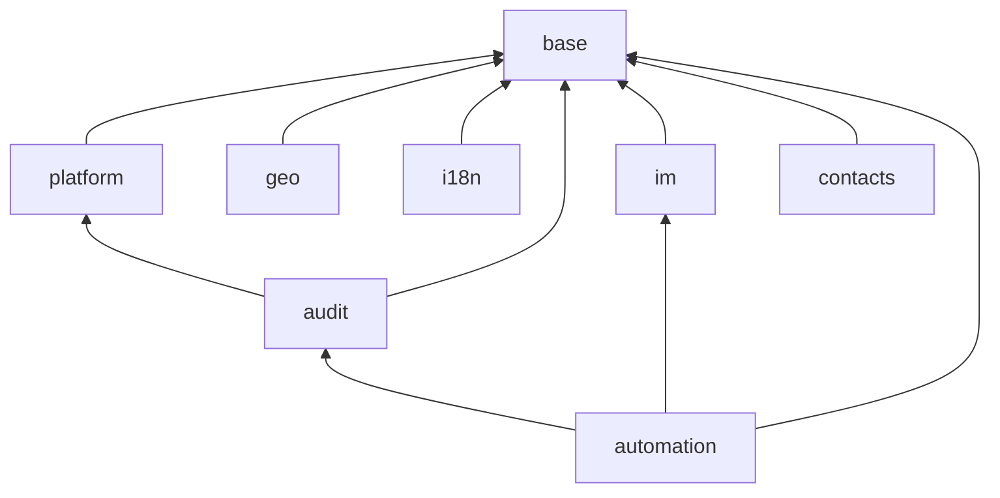

# Sumeru core addons

Installable modules shipped with the `sumeru` Go module. Each folder name equals the manifest `name`.

## Module index

| Module | Type | Depends | Purpose |
|--------|------|---------|---------|
| **base** | Application | — | Kernel: users, companies, partners, security |
| **audit** | Technical | base, platform | Audit trail, retention, exports (auto_install) |
| **platform** | Technical | base | Attachments, sequences, parameters, reports, import (auto_install) |
| **geo** | Technical | base | Countries, states, cities, currency (auto_install) |
| **i18n** | Technical | base | Internationalization: languages, translations, PO catalogs (auto_install) |
| **im** | Technical | base | Internal P2P chat (`im.message`, auto_install) |
| **contacts** | Application | base | Contacts app over `core.partner` (reference layout) |
| **automation** | Technical | base, audit, im | Cron, workflow transitions, server actions |
| **calendar** | Application | base, im, contacts | Calendar events |
| **digest** | Technical | base, im | KPI digest cron |
| **sumeru_ai** | Application | base | Optional AI shell hooks (`auto_import: false`) |

## Dependency graph

## Standard

See [core/module/addon_template/MODULE_STANDARD.txt](../core/module/addon_template/MODULE_STANDARD.txt) and **contacts** for layout conventions.
